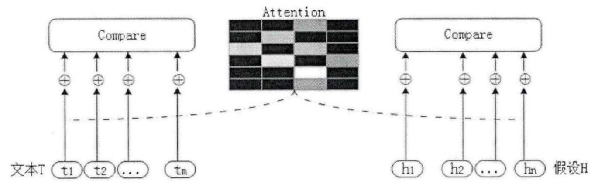
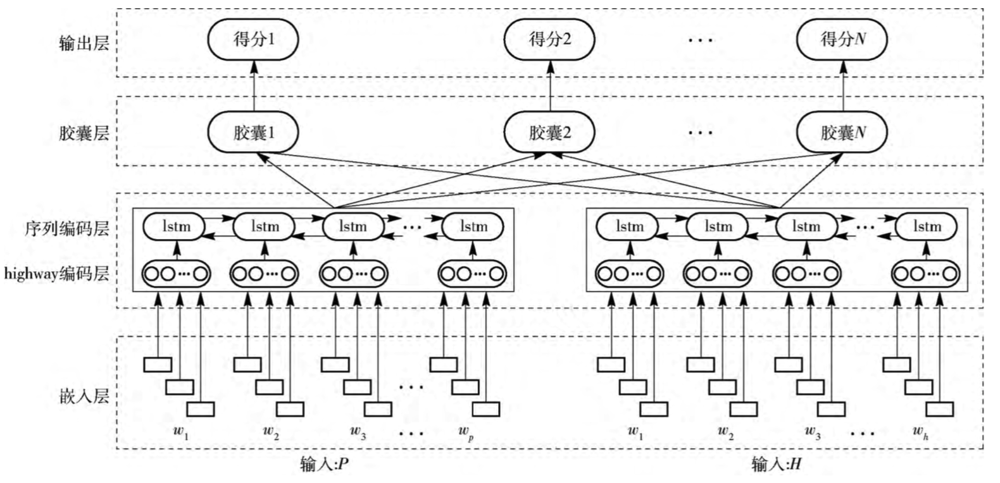

# Entailment with TensorFlow

## Introduction
The text's entailment is a simple logical exercise to determine whether a sentence can be inferred from another sentence. A computer program that undertakes the task of entailment of text, attempts to classify an ordered sentence into one of three categories. The first type is called "positive entailment", which appears when you use the first sentence to prove that the second sentence is correct. The second category, "negative entailment" is the opposite of positive entailment. This happens when the first sentence is used to negate the second sentence. Finally, if the two sentences are not related, they are considered "neutral entailment".

## Example

When you read "Maurita and Jade both were at the scene of the car crash", you can infer "Multiple people saw the accident". In this example sentence, we can use the first sentence (also called "text") to prove the second sentence (also called "hypothesis"), which stands for positive entailment. Given that both Morita and Jed saw the car accident, many people saw it. Note: "Car accident" and "accident" have similar meanings, but they are not the same word. In fact, entailment does not always mean that there are the same words in the sentence, just like the only word you can see in this sentence is "the".
Let us consider another sentence pair. "Two dogs playing with the elderly in the park" deduced that "there was only one dog in the park that day". The first sentence says "two dogs", then there must be at least two dogs in the park. The second sentence contradicts this view, so it is negative entailment.
Finally, in order to clarify the neutral entailment, we look at the words "I play baseball with children" and "kids love ice cream." Playing baseball has nothing to do with ice cream. I can play baseball with ice cream lovers, and I can also play baseball with people who don't like ice cream (both are possible). Therefore, the first sentence does not state whether the second sentence is true or false.

## Apply

Question answering systems (QA) can use textual details to verify the answers to stored information. Textualization can also enhance the summary of a document by filtering sentences that do not contain new information. Similar applications found by other natural language processing systems (NLP)

---


This article will be divided into three parts:

- [Source code environment configuration](#env)

- [Textual entailment Based on LSTM Method](#env1)

- [Improved strategy](#env2)

---

## <span id="env">Source code environment configuration</span>

Two types of environment configuration options have been provided in [Origin author README](https://github.com/Steven-Hewitt/Entailment-with-Tensorflow/blob/master/README.md). Here, the detailed steps (two methods) of anaconda installation tensorflow are mainly supplemented:


### - option A:

#### 1. Create TensorFlow dependency environment
```
conda create -n tensorflow python=3.5
```
#### 2. Download and install dependent package, using Tsinghua University mirror repository, choose the appropriate whl file address for installation
```
pip install -i https://pypi.tuna.tsinghua.edu.cn/simple/ https://mirrors.tuna.tsinghua.edu.cn/tensorflow/windows/cpu/tensorflow-1.1.0-cp35-cp35m-win_amd64.whl
```
#### 3. After successful installation, follow the original author's README to activate the environment and install other dependencies.

### - option B:

#### 1. install TensorFlow
```
pip3 install tensorflow
```

#### 2. Add the TensorFlow installation path at the beginning of the code, for example:

```
import sys
sys.path.append('/usr/local/lib/python3.7/site-packages')
```


## <span id="env1">Textual entailment Based on LSTM Method</span>

### 1. Vectorization represents words

For neural networks, it is necessary to process values. The process of converting the meaning of words into numbers that can be understood by neural networks is called word vectorization.
A common way to create word vectorization is to have each word represent a point in a very high-dimensional space. There are already some excellent general vector representations, and the ones used in this project are**Stanford GloVe word vectorization+ SNLI dataset**. GloVe is also a word vector representation with high accuracy at present.
  notebook code cell(Marking is subject to one pass)：

  **In[2-4]**: Collect textual entailment dataset and decompress

  **In[5]**: Serialize space-delimited format to a Python dictionary

  **In[6]**: Sentence serialization

  **In[7]**: Visualize sentence vectors into images. In general, two vectors containing similar colors at the same position indicate that words are similar in meaning.

### 2. Sentence coding technology based on BiLSTM

This project is based on **RNNs**. Recurrent neural networks (RNNs) is a sequence learning tool for neural networks. TensorFlow includes its own implementation of a simple RNN cell, BasicRNNCell. An RNN network is constructed at **In[8]**.

**In[9-10]** Some network constants are defined.

However, RNNs have the problem of **gradient disappearance**. Early data is completely overwhelmed by updated inputs and information, or neural networks with standard hidden units cannot maintain information for a long time.

The solution is to use a different recurrent network layer, the long-term and short-term memory layer, which is LSTM. In LSTM, instead of using the same input (xt) every time when calculating the current memory, the network can make a decision by "input gate" (it) to determine the degree of influence of the current value on the memory. The forgotten memory (ct) of the "forget gate" (ft) makes another decision, making a third decision based on the memory sending certain parts through the "output gate" (ot) to the next time step (ht). The combination of these three gates creates a choice: a single LSTM node can store information in long-term storage or short-term storage, but not at the same time. **In[11]** settings do not include the previous RNN network, but use the LSTM defined after **In[12]**.

### 3. Tensorflow's DropoutWrapper for the recurrence layer

If we simply use the LSTM layer, the network may read many common but irrelevant words, such as "a", "the", and "and". If one sentence uses the phrase "an animal" and another sentence uses the "the animal", even if the phrases refer to the same object, the network may mistakenly believe that it has found a negative entailment.

In order to solve this problem, we need to see if the individual words are ultimately significant to the whole. We implement this through a regularization process called "dropout". In order to prevent **overfitting**, dropout randomly extracts the parts contained in the network during the training process and temporarily zeros them during training so that their output will be scaled appropriately.

However, dropout does not perform particularly well on the internal gate of the LSTM layer, so we will skip dropout on the internal gate. Thankfully, this is the default implementation of Tensorflow's DropoutWrapper for the loop layer.
**In[14]** implement:

```python
lstm_drop =  tf.contrib.rnn.DropoutWrapper(lstm, input_p, output_p)
```

### 4. Finish the model

With all the explanations, complete the model in **In[14]**. The first step is tokenization, using our GloVe dictionary to turn two input sentences into a sequence of vectors. Since we cannot effectively use the information passed in the LSTM, we will use the functional dropout from the word and the final output instead of effectively using the dropout in the first and last layers of the expanded LSTM network part.

In order to test accuracy and start adding optimization constraints, it is necessary to **show how TensorFlow calculates the accuracy or percentage of accurate prediction labels**.

**In[15]** determined a loss to show the health of the network. Since we have classification scores and optimal scores, the choice here is to use the change in softmax loss from TensorFlow: tf.nn.softmax_cross_entropy_with_logits. We increased the loss of regularization to help overfit, and then prepared an optimizer to learn how to reduce the loss.

**In[16]** Since we installed TQD before, we can track the progress of network training.

**In[17]** is a model test, insert the test sentence by yourself, and the final output is "Positive entailment".

**In[18]** End system to release system resources.

## <span id="env2">Improved strategy</span>

### 1. Development of Textual entailment recognition algorithms

   - Similarity-based method

By calculating the similarity between the premise and the hypothesis, it is judged whether they constitute an implication relationship. It is simple and easy to implement, but this method forcibly assumes that "similarity and implication" is obviously flawed, which will lead to a large number of textual implication relations recognition errors.
         &emsp;&emsp;Jijkoun ["Recognizing Textual Entailment Using Lexical Similarity"](http://u.cs.biu.ac.il/~nlp/RTE1/Proceedings/jijkoun_and_de_rijke.pdf)

   - Text alignment based approach

Instead of directly using the similarity to determine the implication relationship, first align the premise with the hypothetical similarity, and use the alignment method and degree as the basis for determining whether the implication relationship is the final one. The advantage is that it can better reflect the similarity between the two texts. The disadvantage is that prior knowledge needs to be introduced for alignment, and some one-to-many and many-to-many alignment situations are difficult to operate.
         &emsp;&emsp;Marneffe paper["Finding Contradictions in Text"](http://www.aclweb.org/anthology/P08-1118)
   - Based on logical calculus

Texts are generally expressed as mathematical logic expressions, such as first-order logic, to form a set of facts, and then logical inference rules are used to determine whether hypotheses can be inferred based on premises. There is a certain theoretical basis for migrating the mature ideas in the field of machine proof in the field of mathematics to the field of text implication recognition, but the conversion of text to logical expressions is not robust enough and its fault tolerance is poor. The lack of background knowledge often leads to the interruption of the reasoning chain, resulting in a low recall rate.
         &emsp;&emsp;Raina paper["Robust textual inference via learning and abductive reasoning"](https://nlp.stanford.edu/manning/papers/aaai05-learnabduction.pdf)
   - Text transfer based conversion

Semantic role annotations represent premises and assumptions in some form of linguistic representation, such as syntax trees, dependency graphs, etc. Then use background knowledge to design reasoning rules to rewrite premises and assumptions. The kernel based on logical calculus is retained, and the premises and assumptions are no longer required to be expressed as logical expressions, which avoids introducing noise, but this method relies heavily on conversion rules. Some of these conversion rules come from the knowledge base and some from the corpus.
         &emsp;&emsp;Bar-Haim's paper["Semantic Inference at the Lexical-Syntactic Level"](http://www.aaai.org/Papers/AAAI/2007/AAAI07-138.pdf)
   - Based on hybrid model
Mix features such as premise and hypothetical word-level similarity (such as word overlap, synonyms, antonyms, etc.), syntactic tree similarity, syntactic tree editing distance, alignment degree, cost of conversion from T to H, etc. as features, Send to a classifier (such as support vector machine, etc.) for classification.

   - Models based on deep learning
The advantage of modeling by building a neural network is that the machine automatically performs feature extraction, filtering, and combination, avoiding the limitations of manual feature extraction. The disadvantage is that the amount of data required is large, and the design of the network structure directly affects the quality of the extracted features.

         &emsp;&emsp;Yin's paper["ABCNN: Attention-Based Convolutional Neural Network for Modeling Sentence Pairs"](https://arxiv.org/pdf/1512.05193.pdf)
         &emsp;&emsp;Rocktäschel's paper["Reasoning about Entailment with Neural Attention"](https://arxiv.org/pdf/1509.06664.pdf)——The accuracy of RTE using LSTM on the SNLI dataset is 0.832.

### 2. Entailment with TensorFlow improve

   - attention mechanisms

The traditional hard alignment method analyzes grammatical structure or dependency analysis of text T and hypothesis H, and aligns text T and hypothesis H according to grammatical components, such as subject-to-subject alignment, predicate-to-predicate alignment. However, due to the diversity and complexity of grammatical structures in English texts, there are some problems with the hard alignment method, such as incorrect analysis of the grammatical structure and overly complex grammatical components that are difficult to align.
The soft alignment method based on the attention mechanism considers that the text T is related to each word in the hypothesis H, but the relevance weights are different. The attention relationship matrix between text representations is constructed without considering the text length. Compared to hard alignment, soft alignment is more scalable.
  
     &emsp;&emsp;The tensorflow 1.0 and later api seq2seq library contains two types of Attention algorithms. The difference between them is the difference in the match operation, which is also called addition Attention and multiplication Attention.

```
attention_mechanism = tf.contrib.seq2seq.BahdanauAttention(rnn_hidden_size, encoder_output)
decoder_cell = tf.contrib.seq2seq.AttentionWrapper(d_cell, attention_mechanism, attention_layer_size=rnn_hidden_size)
de_state = decoder_cell.zero_state(batch_size,dtype=tf.float32)
out_cell = tf.contrib.rnn.OutputProjectionWrapper(decoder_cell, target_vocab_size)
```

```
attention_mechanism = LuongAttention(num_units =num_units,memory=context)
att_wrapper = AttentionWrapper(cell=mutil_layer,attention_mechanism=attention_mechanism,attention_layer_size=att_size,cell_input_fn=lambda input, attention: input)
states = att_wrapper.zeros_state(batch_size, tf.float32)
```

Capsule-based English text implication recognition method The paper also proposes a capsule-based English text implication recognition algorithm: it constructs capsules for different types of implication relationships, so that each capsule can describe the characteristic information of its corresponding implication relationship.
    

   - Lemmatization

The Textual Entailment with TensorFlow project uses stemming. The goal of stemming extraction is to extract the root of a word. Different words may have the same root. The root itself is no longer a word, so the result after extraction. There may no longer be full semantics. The morphological reduction only needs to process the affix information of different words to obtain a normalized representation of the word itself.

```
from nltk.stem import WordNetLemmatizer
wnl = WordNetLemmatizer()
```

   - Digital normalization
     

There are multiple ways of representing the same number in English, which makes it difficult to identify subsequent implication relationships. Different forms of numbers can be unified into Arabic numbers.

   - Remove stop words
     
For example, "the", "is", "at", etc. are not very helpful and frequently appear in the recognition of implication relations in English text implication recognition. You can remove these stop words.


------

Reference:

1. [基于混合神经网络的英文文本蕴含识别研究与实现_朱皓](http://cdmd.cnki.com.cn/Article/CDMD-10013-1018116971.htm)
2. [A Decomposable Attention Model for Natural Language Inference](https://arxiv.org/pdf/1606.01933.pdf)
3. [深度学习：如何理解tensorflow文本蕴含的原理](https://cloud.tencent.com/developer/article/1049549)
